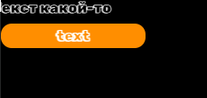

## Описание проекта

Тестовое задание https://shorthaired-artichoke-8a6.notion.site/MF-f5483f56c44f447ea5aa00ab20057ffe

От себя: userCard и userProfile можно было бы объединить, думаю. Немного по ТЗ не понял часть с выбором аватарки, смутило модальное окно в модальном окне. Я сделал немного по-своему, добавил возможность загружать свои аватарки. Если это критично - я могу переделать, только немного надо по ТЗ пояснить 🙃

Tooltip. Конечно, хотелось бы сделать его более качественно. С анимацией появления с разных сторон и ТД. Но я был ограничен временем + работа + сроки... 😔
Сейчас принцип работы довольно простой. Приоритет на появление сверху, если тултип не влазит - снизу, а также проверки на лево / право.
Вот кейсик с прижатым текстом в левом верхнем углу экрана + смещение влево (тултип при этом в рамках ViewPort):

На нормальный сервачок не хватает времени, залил пока все на GitHubPages🙈
https://pavelpotapov.github.io/buildDataDiving/ 



## Архитектура

### FSD


<a href="https://feature-sliced.design/docs/get-started/overview">Подробнее 🚀</a>

## Технологии

### Node.js 18.12.0


### TypeScript 5.2.2


### Webpack 5.88.2


### Redux Toolkit (RTK) 2.2.4 + RTK Query 2.2.4


### SCSS Modules


- Sass: 1.69.0
- Sass-loader: 13.3.2

### Formik 2.4.6 и Yup 1.4.0

 & Yup


### Firebase 10.11.1


Firebase используется как облачное хранилище для данных приложения. Использовал RTD (Realtime Database)

## Установка и запуск проекта

1. Клонируйте репозиторий:
   ```bash
   git clone https://github.com/PavelPotapov/DataDiving
   ```
2. Установите зависимости:
   ```bash
   cd DataDiving
   npm install
   ```
3. Запуск
   ```bash
   npm start
   ```

###  [PavelPotapov](https://t.me/Pavel_Potapov)
